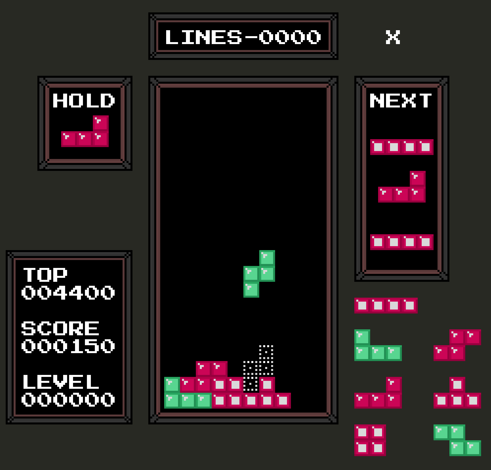
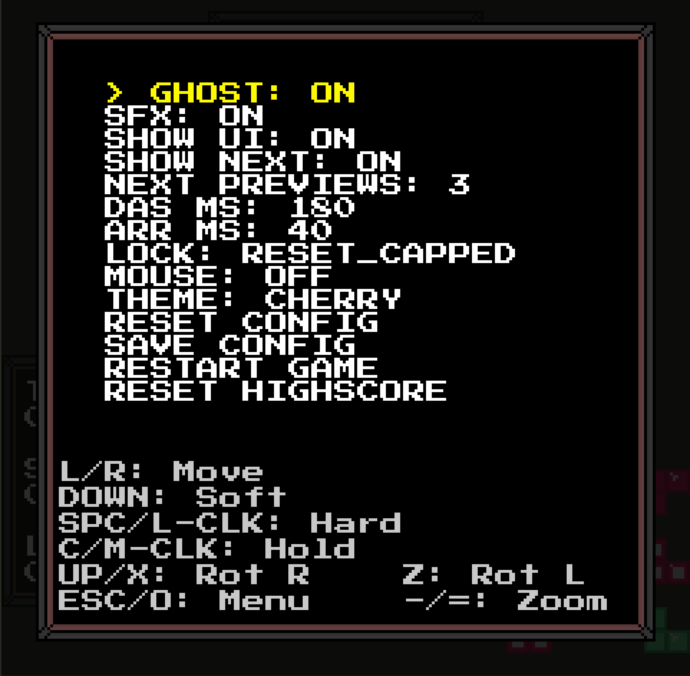

## Tetris - Rewritten in Odin (from C)

Written with Raylib.
```zsh
# Installation:
$ brew install odin

# Build and run with:
$ odin run .

# Or build an executable with:
$ odin build .
$ ./tetris
```

First time exploring Odin and it's been an extremely enjoyable experience.

Rules and features based from the [tetris wiki](https://tetris.wiki/Tetris.wiki).

**Controls:**
- Left/right arrows or mouse for left/right piece movement.
- Down arrow for soft drop, Spacebar for hard drop.
- Up arrow (or X) to rotate right, Z to rotate left.
- C to hold the current piece or swap it with the held piece.
- `-` to zoom out, `=` to zoom in.
- Esc to view and modify the game and display configuration.



